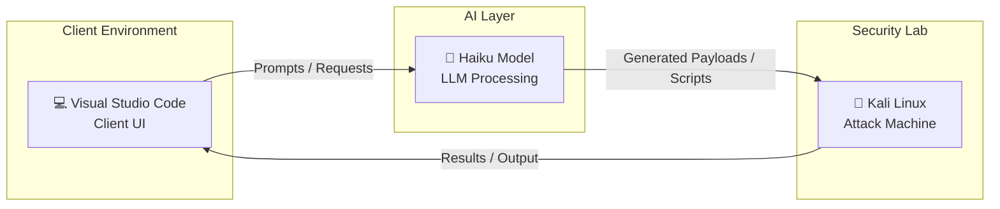

# Kali Linux + LLM (Visual Studio Code) Setup

This guide shows how to use a **Large Language Model (LLM)** to control
**Kali Linux penetration testing tools** using natural language.

Instead of manually running commands in a terminal, you can ask
something like:

> "Run a port scan on scanme.nmap.org"

The model interprets the request and executes the appropriate Kali tool.

------------------------------------------------------------------------

# Architecture



The system consists of three main components:

| Component             | Description           | Role                                                                     |
| --------------------- | --------------------- | ------------------------------------------------------------------------ |
| 💻 **Client UI**      | Visual Studio Code    | Development interface used to interact with the LLM and run tests        |
| 🐉 **Attack Machine** | Kali Linux            | Offensive security environment used for penetration testing              |
| 🤖 **LLM**            | Anthropic Haiku Model | AI model used to assist with analysis, payload generation and automation |

Communication between the model and Kali tools happens through **Model
Context Protocol (MCP)**.

------------------------------------------------------------------------

# Workflow

1.  The user sends a prompt to the LLM (Haiku) via Visual Studio Code
2.  The LLM (Haiku) interprets the request
3.  The LLM (Haiku) selects the appropriate tool
4.  MCP server executes the command on Kali
5.  Results are returned to the LLM (Haiku)
6.  The LLM (Haiku) analyzes and explains the output

Example:

Prompt:

    Scan scanme.nmap.org

Executed command:

    nmap scanme.nmap.org

------------------------------------------------------------------------

# Requirements

-   Kali Linux
-   Visual Studio Code
-   SSH access between host and Kali
-   Kali penetration testing tools

------------------------------------------------------------------------

# SSH Setup

## Install SSH on Kali

``` bash
sudo apt update
sudo apt install -y openssh-server
sudo systemctl enable --now ssh
```

Check service status:

``` bash
sudo systemctl status ssh
```

------------------------------------------------------------------------

## Create SSH Key

``` bash
ssh-keygen
```

View the public key:

``` bash
cat ~/.ssh/id_ed25519.pub
```

Copy the key to Kali:

``` bash
ssh-copy-id user@kali-ip
```

Test the connection:

``` bash
ssh user@kali-ip
```

------------------------------------------------------------------------

# Install MCP Server on Kali

Install the MCP server:

``` bash
sudo apt install -y mcp-kali-server
```

Start the server:

``` bash
kali-server-mcp
```

Expected output:

    Starting Kali Linux Tools API Server on 127.0.0.1:5000
    Running on http://127.0.0.1:5000

------------------------------------------------------------------------

# Install Required Kali Tools

Install common penetration testing tools:

``` bash
sudo apt install -y \
mcp-kali-server \
dirb gobuster nikto nmap \
enum4linux-ng hydra john \
metasploit-framework sqlmap \
wpscan wordlists
```

Extract the **rockyou** password list:

``` bash
sudo gunzip /usr/share/wordlists/rockyou.txt.gz
```

------------------------------------------------------------------------

# Test

Example prompt:

    Run a port scan on scanme.nmap.org

Kali will execute:

    nmap -sV scanme.nmap.org

------------------------------------------------------------------------

# Result

You can control Kali Linux penetration testing tools using **natural
language commands**.

Final stack:

-   Kali Linux
-   SSH
-   MCP Server
-   Visual Studio Code
-   Anthropic Haiku LLM

------------------------------------------------------------------------

# Disclaimer

Use these tools **only on systems you are authorized to test**.\
Unauthorized use may violate local laws.

------------------------------------------------------------------------

# References

-   Kali Linux
-   Model Context Protocol
-   Anthropic Claude
-   Visual Studio Code
